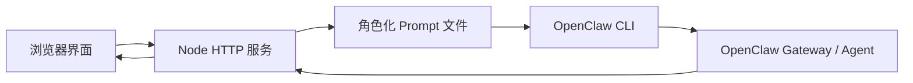

# 设计说明

## 架构



## 前端

前端位于 `public/`：

- `index.html`：界面结构
- `styles.css`：布局与视觉
- `app.js`：角色模板、对话循环、停止控制、导出

浏览器端负责按轮次调度：

1. 第奇数句由 A 发言
2. 第偶数句由 B 发言
3. 每次只请求一轮
4. 人工停止时中断当前请求并停止后续循环

## 后端

后端位于 `server.js`，提供：

- `GET /api/health`：检查 OpenClaw CLI 是否存在
- `POST /api/turn`：生成单轮角色发言
- 静态文件服务

每轮生成时，后端构造包含以下内容的 Prompt：

- 讨论主题
- 可用资料
- 当前角色身份、目标、可用资料、禁止事项、结束条件
- 对方角色摘要
- 已有对话
- 最大轮数和停止词

模型被要求返回 JSON：

```json
{
  "message": "角色发言",
  "shouldStop": false,
  "stopReason": ""
}
```

## 停止机制

系统支持四类停止：

- 最大轮数：前后端都限制为 `<= 6`
- 停止词：如“结束”“停止”“DONE”“同意收束”
- 角色自判：模型返回 `shouldStop: true`
- 人工停止：用户点击停止按钮

## 异常处理

如果 OpenClaw CLI 不存在、超时、返回空值或返回格式不可解析，后端会：

1. 记录 warning
2. 返回本地兜底发言
3. 在前端消息 provider 中标记 `fallback`

这样 Demo 不会因为模型或网关短暂异常而卡死。

## 数据边界

- API Key 不进入前端
- Prompt 临时文件写在 `work/`，调用结束后删除
- 对话导出仅包含角色配置、主题、资料和生成内容
